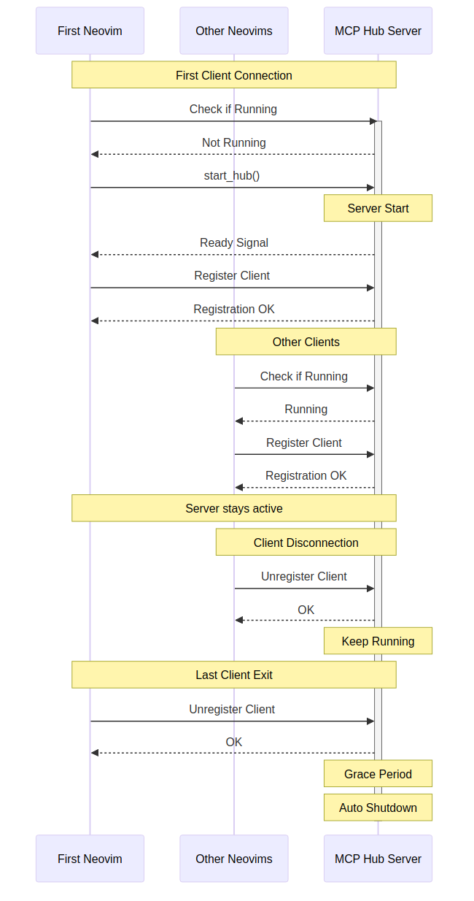
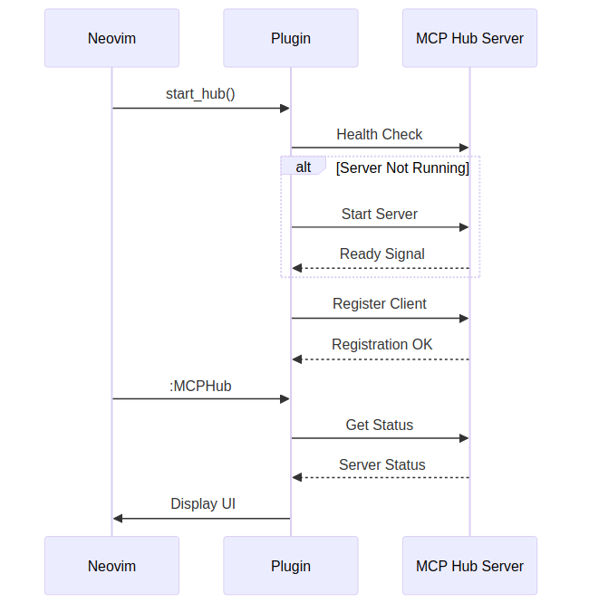
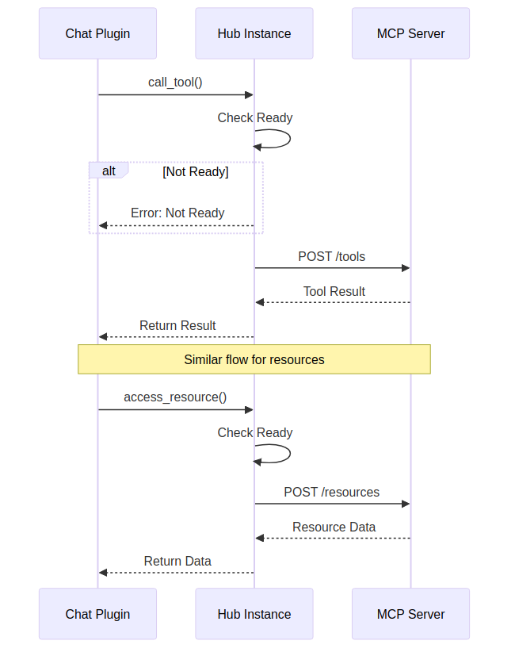

# MCPHub.nvim

[](https://neovim.io)
[](https://www.lua.org)
[](https://opensource.org/licenses/MIT)
[](./CONTRIBUTING.md)

> A powerful Neovim plugin for managing MCP (Model Context Protocol) servers through [mcp-hub](https://github.com/ravitemer/mcp-hub).

## ✨ Features

- Simple single-command interface (`:MCPHub`)
- Automatic server lifecycle management
- Async operations - no blocking
- Clean client registration/cleanup
- Smart process handling
- Configurable logging support

## Installation

Using [lazy.nvim](https://github.com/folke/lazy.nvim):

```lua
{
    "ravitemer/mcphub.nvim",
    dependencies = {
        "nvim-lua/plenary.nvim",  -- Required for HTTP requests
    },
    build = function()
        -- Install mcp-hub globally
        vim.fn.system("npm install -g mcp-hub")
    end,
    config = function()
        require("mcphub").setup({
            port = 3000,  -- Port for MCP Hub server
            config = vim.fn.expand("~/.config/mcp-hub/config.json"),  -- Config file path
            log = {  -- Optional logging configuration
                level = vim.log.levels.WARN,  -- Log level (ERROR, WARN, INFO, DEBUG)
                to_file = false,  -- Whether to log to file
                file_path = nil,  -- Log file path
                prefix = "MCPHub"  -- Log message prefix
            }
        })
    end
}
```

## Usage

### For Chat Plugin Developers

```lua
local mcphub = require("mcphub")

-- Setup plugin with logging
mcphub.setup({
    port = 3000,
    config = vim.fn.expand("~/.config/mcp-hub/config.json"),
})

-- Start server/connect
mcphub.start_hub({
    on_ready = function(hub_instance)
        -- Ready to use MCP features
        hub_instance:get_servers(function(servers)
            -- Use servers data
        end)
    end,
    on_error = function(err)
        -- Error will be automatically logged
    end
})

-- Get instance for API access (all methods are async)
local hub = mcphub.get_hub_instance()

-- Call a tool
hub:call_tool("server-name", "tool-name", {
    -- Tool arguments
}, function(result, error)
    if error then
        -- Error will be automatically logged at appropriate level
        return
    end
    -- Use tool result
end)

-- Access resources
hub:access_resource("server-name", "resource://uri", function(resource, error)
    if error then
        -- Error will be automatically logged
        return
    end
    -- Use resource data
end)

-- Get server status
hub:get_status(function(status)
    -- Use status information
end)

-- Get available servers
hub:get_servers(function(servers)
    -- Use servers list
end)

-- Get specific server info
hub:get_server_info("server-name", function(server)
    if server then
        -- Server found
    else
        -- Server not found
    end
end)

-- Shutdown (optional, handled automatically on `VimLeavePre`)
-- mcphub.stop_hub()
```

## API Reference

### REST API Endpoints

You can directly access the MCP Hub server's API at `http://localhost:<port>/api/`. Available endpoints:

- `GET /api/health` - Server health check
- `GET /api/servers` - List all connected servers
- `GET /api/servers/{name}` - Get specific server info
- `POST /api/servers/{name}/tools` - Call a tool
- `POST /api/servers/{name}/resources` - Access a resource

### MCP Server Schema

Each MCP Server information follows this schema:

```typescript
{
  name: string,
  status: "disconnected" | "connecting" | "connected",
  error: string | null,
  capabilities: {
    tools: Array<{
      name: string,
      description: string,
      parameters: object // Tool-specific parameters
    }>,
    resources: Array<{
      uri: string,
      type: string
    }>,
    resourceTemplates: Array<{
      uriTemplate: string,
      type: string
    }>
  },
  uptime: number,    // Server uptime in seconds
  lastStarted: string // ISO timestamp
}
```

### Tool Response Schema

```typescript
{
  result: any, // Tool-specific result data
  error?: string // Error message if failed
}
```

### Resource Response Schema

```typescript
{
  content: any,   // Resource content
  type: string,   // Resource type
  error?: string  // Error message if failed
}
```

For development and debugging, you can directly query these endpoints.

## Architecture

### Server Lifecycle



The diagram above shows how multiple Neovim instances interact with a single MCP Hub server. The first instance starts the server, while others connect to the existing one. When the last client disconnects, the server automatically shuts down.

### Request Flow



All operations are asynchronous, using callbacks to handle responses. This ensures Neovim stays responsive even during network operations. The diagram shows the request flow from initial startup to status display.

### Cleanup Process


The cleanup process ensures proper resource management and server shutdown. It handles both individual client disconnection and full server shutdown when appropriate.

### API Interaction



All API interactions are asynchronous and follow this pattern:

1. Check ready state
2. Make request
3. Handle response in callback
4. Error handling in callback

## Async API Reference

```lua
-- Server Management
hub:check_server(callback)           -- callback(is_running: boolean)
hub:get_status(callback)            -- callback(status: table)
hub:get_servers(callback)           -- callback(servers: table)
hub:get_server_info(name, callback) -- callback(server: table|nil)

-- Tool/Resource Access
hub:call_tool(server, tool, args, callback)      -- callback(result: table|nil, error?: string)
hub:access_resource(server, uri, callback)       -- callback(result: table|nil, error?: string)

-- Health/Status
hub:is_ready()        -- returns boolean (sync, safe to call)
hub:display_status()  -- shows UI with current status
```

## Logging Configuration

The plugin supports configurable logging with the following options:

```lua
{
    level = vim.log.levels.WARN,  -- Log level threshold
    to_file = false,             -- Enable file logging
    file_path = nil,             -- Path to log file
    prefix = "MCPHub"            -- Prefix for log messages
}
```

## Requirements

- Neovim >= 0.8.0
- [plenary.nvim](https://github.com/nvim-lua/plenary.nvim)
- Node.js >= 18.0.0 (for mcp-hub)
- [mcp-hub](https://github.com/ravitemer/mcp-hub)

## Error Handling

```lua
-- Example error handling pattern
hub:call_tool("server", "tool", args, function(result, error)
    if error then
        -- Errors are automatically logged at appropriate levels
        return
    end
    -- Use result
end)
```

## Troubleshooting

1. **Server Won't Start**

   - Check if port is available
   - Verify mcp-hub installation
   - Check config file path
   - Enable DEBUG log level for detailed output
   - Check log file if file logging enabled
   - Test API directly: `curl http://localhost:3000/api/health`

2. **Connection Issues**

   - Ensure server is running (quick health check timeout)
   - Check port configuration
   - Verify client registration
   - Monitor log output for connection attempts
   - Test API endpoints directly with curl

3. **Status Shows Not Ready**
   - Call mcphub.start_hub()
   - Check server health
   - Verify connection state
   - Check error callbacks
   - Review logs for startup sequence
   - Check API health endpoint

## 🤝 Contributing

Contributions are welcome! Please read our [Contributing Guidelines](./CONTRIBUTING.md) for details on how to submit pull requests, report issues, and contribute to the project.

## 🔒 Security

Found a security issue? Please review our [Security Policy](./SECURITY.md) and follow the vulnerability reporting process.

## 📝 Changelog

See [CHANGELOG.md](./CHANGELOG.md) for a detailed list of changes between releases.

## 📜 Code of Conduct

This project follows a [Code of Conduct](./CODE_OF_CONDUCT.md) to ensure a welcoming and inclusive environment for all contributors.

## 📄 License

This project is licensed under the MIT License - see the [LICENSE.md](./LICENSE.md) file for details.

## 🗺️ Roadmap

### Upcoming Features

1. **Enhanced UI Integration**

   - Lazy.nvim/Mason-style interface for MCP server management
   - Interactive server status dashboard
   - Tool and resource browser with filtering and search
   - Rich command palette integration
   - Floating windows for tool execution and resource viewing

2. **Prompt Engineering Utilities**

   - Smart server selection based on prompt content
   - Automatic tool/resource selection helpers
   - Prompt templates and generators
   - Context-aware prompt building
   - Response parsing and formatting utilities

3. **Server Management Improvements**

   - Server health monitoring dashboard
   - Performance metrics and analytics
   - Auto-recovery and failover strategies
   - Configuration management UI
   - Batch operations support

4. **Developer Tools**

   - Server capability introspection
   - Tool response debugger
   - Request/response logging viewer
   - Performance profiling tools
   - Test utilities for MCP integrations

5. **Quality of Life Features**
   - Command history and favorites
   - Customizable keymaps
   - Telescope integration
   - Snippet generation from responses
   - Session persistence

### Long-term Goals

1. **Community Integration**

   - Server discovery and sharing
   - Tool/resource marketplace
   - Community templates and configs
   - Integration guides and examples

2. **Advanced Features**
   - Multi-server orchestration
   - Response caching and optimization
   - Custom server templates
   - Automated workflow creation
   - Integration with popular Neovim plugins

Your contributions and suggestions are welcome! Feel free to open issues or submit pull requests to help implement these features.

## ⭐ Show Your Support

Give a ⭐️ if this project helped you!
